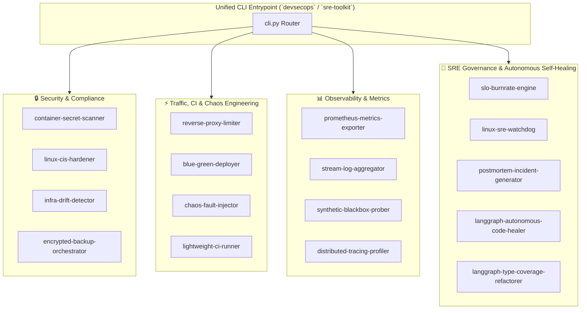

# 🛡️ DevSecOps & SRE Resilience Toolkit

[](https://github.com/cibi-dev/devsecops-sre-toolkit/actions/workflows/ci.yml)
[](https://python.org)
[](SECURITY.md)
[](https://github.com/PyCQA/bandit)
[](tests/)
[](packages/)
[](LICENSE)

An enterprise-grade, production-ready **DevSecOps, Observability, SRE & Autonomous Resilience Platform** consolidating **17 specialized engineering packages** into a unified monorepo and CLI interface.

---

## 🏛️ Suite Architecture



---

## 📦 Consolidated 17 Specialized Modules

| # | Package Name | Directory | Domain | Key Technology / Standards |
|---|---|---|---|---|
| **1** | `container-secret-scanner` | [`packages/container-secret-scanner`](packages/container-secret-scanner) | DevSecOps | AST parsing, Shannon entropy, OCI tar layer scanner |
| **2** | `linux-cis-hardener` | [`packages/linux-cis-hardener`](packages/linux-cis-hardener) | Compliance | CIS Benchmark Level 1, idempotent remediation, non-root audit |
| **3** | `infra-drift-detector` | [`packages/infra-drift-detector`](packages/infra-drift-detector) | IaC / Drift | Baseline schema diffing, state enforcement, policy auditing |
| **4** | `encrypted-backup-orchestrator` | [`packages/encrypted-backup-orchestrator`](packages/encrypted-backup-orchestrator) | DR / Crypto | AES-256-GCM, Zstandard compression, GFS retention rotation |
| **5** | `reverse-proxy-limiter` | [`packages/reverse-proxy-limiter`](packages/reverse-proxy-limiter) | Traffic / Mesh | Token bucket rate limiting, circuit breaker, round-robin proxy |
| **6** | `chaos-fault-injector` | [`packages/chaos-fault-injector`](packages/chaos-fault-injector) | Chaos Eng | CPU saturation, packet drop simulation, process kill guards |
| **7** | `slo-burnrate-engine` | [`packages/slo-burnrate-engine`](packages/slo-burnrate-engine) | SRE Reliability | Multi-Window Multi-Burn-Rate alerting, Error Budget tracking |
| **8** | `linux-sre-watchdog` | [`packages/linux-sre-watchdog`](packages/linux-sre-watchdog) | Self-Healing | Procfs memory/CPU watchdog, anti-flapping circuit breaker |
| **9** | `prometheus-metrics-exporter` | [`packages/prometheus-metrics-exporter`](packages/prometheus-metrics-exporter) | Observability | OpenMetrics exposition, alert threshold evaluation, webhooks |
| **10** | `stream-log-aggregator` | [`packages/stream-log-aggregator`](packages/stream-log-aggregator) | Log Ingestion | High-throughput buffer pipeline, Grok parsing, PII redaction |
| **11** | `synthetic-blackbox-prober` | [`packages/synthetic-blackbox-prober`](packages/synthetic-blackbox-prober) | Monitoring | HTTP/HTTPS, TCP, DNS, TLS SSL expiry synthetic probes |
| **12** | `blue-green-deployer` | [`packages/blue-green-deployer`](packages/blue-green-deployer) | CI/CD | Zero-downtime blue/green deployment, canary health checks |
| **13** | `distributed-tracing-profiler` | [`packages/distributed-tracing-profiler`](packages/distributed-tracing-profiler) | APM / Tracing | OpenTelemetry OTLP JSON trace profiler, span propagation |
| **14** | `lightweight-ci-runner` | [`packages/lightweight-ci-runner`](packages/lightweight-ci-runner) | CI / Automation | Deterministic DAG runner, process isolation sandbox, JUnit |
| **15** | `postmortem-incident-generator` | [`packages/postmortem-incident-generator`](packages/postmortem-incident-generator) | SRE Governance | Blameless 5-Whys RCA, MTTD/MTTR metrics, action item SLAs |
| **16** | `langgraph-autonomous-code-healer` | [`packages/langgraph-autonomous-code-healer`](packages/langgraph-autonomous-code-healer) | Agentic AI | Multi-agent autonomous code & security patcher (LangGraph) |
| **17** | `langgraph-type-coverage-refactorer` | [`packages/langgraph-type-coverage-refactorer`](packages/langgraph-type-coverage-refactorer) | Static Analysis | Multi-agent AST type coverage refactorer & test generator |

---

## 🚀 Quickstart & Installation

### Option 1: Native Installation

```bash
git clone https://github.com/cibi-dev/devsecops-sre-toolkit.git
cd devsecops-sre-toolkit

# Install virtualenv & dependencies
python3 -m venv .venv
source .venv/bin/activate
pip install -e ".[dev]"
```

### Option 2: Docker / Docker Compose

```bash
# Run the automated end-to-end multi-engine resilience demo in container
docker compose run --rm sre-toolkit demo
```

---

## 🛠️ Unified CLI Usage (`devsecops`)

The single entrypoint `devsecops` (or `sre-toolkit`) routes commands to all 17 sub-engines:

```bash
# 1. Run full end-to-end multi-engine DevSecOps & SRE demo
devsecops demo

# 2. Security Audit & Secrets Detection
devsecops scan-secrets scan-dir /path/to/src --min-entropy 4.5

# 3. Linux CIS Benchmark Hardening
devsecops cis-audit audit --section ssh,sysctl

# 4. Infrastructure Drift Check
devsecops drift check --baseline baseline.yaml

# 5. Encrypted Incremental Backup (AES-256-GCM + Zstandard)
devsecops backup backup --source /data --target /backups --passphrase "$KEY"

# 6. SRE Error Budget & Burn Rate Calculation
devsecops slo-check calculate --target 0.999 --total 100000 --errors 120

# 7. SRE System Watchdog
devsecops watchdog check --proc-root /proc

# 8. Chaos Engineering Fault Injection
devsecops inject-fault cpu --cores 2 --duration 30

# 9. Synthetic Blackbox Probing
devsecops probe run --target https://example.com --type http

# 10. Generate Blameless Incident Postmortem Report
devsecops postmortem generate --input incident_events.json --output postmortem.md
```

---

## 🔒 DevSecOps & Security Assurance

This toolkit strictly enforces the 17 canonical security controls defined in `SECURITY.md`:
- **Privilege Separation (CWE-250):** Non-root user `sre_user` in Docker container and non-root audit modes.
- **Sensitive Data Redaction (CWE-209):** Automatic PII, token, and credential masking in logs and postmortems.
- **Path Traversal Defenses (CWE-22):** Strict resolution and containment checks in backup and file handling.
- **Cryptographic Hygiene (CWE-330 / CWE-321):** AES-256-GCM AEAD authenticated encryption with PBKDF2-HMAC-SHA256 (600k iterations).
- **Concurrency & Anti-Flapping (CWE-362 / CWE-400):** Monotonic timeouts, `fcntl.flock` locks, and bounded thread pools.

---

## 🧪 Testing & Verification

```bash
# Run full test suite with coverage
pytest tests/ -v --cov=packages

# Run Bandit security vulnerability scan (0 issues required)
bandit -r . -ll
```

---

## 📄 License

MIT License. Copyright (c) 2026 cibi-dev.
