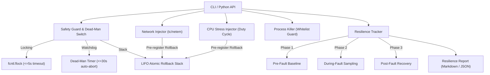

# 🐒 Chaos Fault Injector

[](https://github.com/cibi-dev/chaos-fault-injector/actions/workflows/security-scan.yml)
[](https://github.com/cibi-dev/chaos-fault-injector)
[](https://github.com/PyCQA/bandit)
[](https://github.com/gitleaks/gitleaks)
[](sbom.json)
[](pyproject.toml)
[](LICENSE)

**Chaos Fault Injector** is an enterprise-grade Linux Chaos Engineering engine (inspired by Chaos Monkey and Simian Army) designed to inject controlled, bounded faults—such as network latency/packet loss via `tc`/`netem`, multi-core CPU stress, and process termination—while measuring and generating structured resilience assessment reports.

Built with **Zero-Trust DevSecOps Guardrails**, including a **Dead-Man Switch**, **Atomic LIFO Rollbacks**, **PID 1 / Critical Services Whitelisting**, and non-root `--dry-run` simulation modes.

---

## 🏛️ Chaos Engineering Architecture



---

## ⚡ Core Capabilities

1. **Network Faults (`tc`/`netem`)**:
   - Injection of latency (`--latency-ms`), jitter (`--jitter-ms`), correlation (`--correlation-pct`), packet loss (`--loss-pct`), packet corruption (`--corruption-pct`), duplication (`--duplicate-pct`), and reordering (`--reorder-pct`).
   - Automatically pre-registers and executes `tc qdisc del dev <iface> root` upon expiration or failure.
2. **CPU Stress Engine**:
   - Bounded multi-core or all-core stress with active duty-cycle throttling (e.g. 50% load = 50ms spin / 50ms sleep).
   - Hard maximum execution time ceiling ($\le 30.0\text{s}$).
3. **Targeted Process Killer**:
   - Signal dispatch (`SIGTERM`, `SIGKILL`, `SIGINT`, `SIGHUP`, `SIGQUIT`) against targeted PIDs or process names.
   - Strictly protected whitelist preventing termination of PID 1, `init`, `sshd`, `dbus`, `systemd`, self, or parent PIDs.
4. **Safety Guard & Dead-Man Switch**:
   - Automatic watchdog timer that triggers emergency rollbacks if an experiment does not finish or send heartbeats within the timeout window.
   - POSIX signal handling (`SIGINT`, `SIGTERM`, `SIGHUP`) and `atexit` hooks guaranteeing atomic rollback.
5. **Resilience Assessment Reporter**:
   - Automated 3-phase metric sampling (Pre, During, Post).
   - Computes availability $\%$, error rate $\%$, latency percentiles ($p_{50}, p_{95}, p_{99}$), resource deltas, and composite resilience scores ($0-100$).

---

## 🚀 Quickstart & Installation

```bash
# Clone and enter workspace
cd /home/cibi/Proyectos/projects/chaos-fault-injector/

# Install in editable mode with development & security tools
pip install -e .[dev]
```

---

## 💻 CLI Usage Examples

### 1. Network Fault Injection (Simulated & Real)

```bash
# Dry-run network latency (safe for non-root users)
chaos inject-net --interface eth0 --latency-ms 100 --jitter-ms 20 --loss-pct 5 --duration 10 --dry-run

# Real tc netem injection (requires sudo/root)
sudo chaos inject-net --interface eth0 --latency-ms 80 --jitter-ms 15 --loss-pct 2.5 --duration 15 --report-out /tmp/net_report.md
```

### 2. Bounded CPU Stress

```bash
# Stress 4 cores at 75% load for 10 seconds
chaos stress-cpu --cores 4 --load-pct 75 --duration 10 --report-out /tmp/cpu_report.md
```

### 3. Safe Process Termination

```bash
# Terminate worker process matching whitelist (dry-run)
chaos kill-proc --name "celery-worker" --signal SIGTERM --whitelist "celery*,worker*" --dry-run
```

### 4. Comprehensive Dry-Run Simulation

```bash
# Run simulation and export Markdown report
chaos dry-run --type network --output report.md
```

### 5. Emergency Rollback & Status

```bash
# Immediately revert any tc modifications
sudo chaos rollback --interface eth0

# Inspect system privilege mode and safety guardrails
chaos status
```

---

## 🐍 Python API Usage

```python
from chaos.network import NetworkFaultConfig, inject_network_fault
from chaos.reporter import ResilienceTracker, generate_markdown_report
from chaos.safety_guard import SafetyGuard

# Configure fault parameters
config = NetworkFaultConfig(
    interface="eth0",
    latency_ms=100.0,
    jitter_ms=25.0,
    loss_pct=5.0,
    duration_seconds=10.0,
    dry_run=True,
)

# Execute safely under Dead-Man Switch context
with SafetyGuard(auto_lock=True) as guard:
    guard.start_dead_man(timeout_seconds=12.0)
    result = inject_network_fault(config, safety_guard=guard)
    print(f"Injected successfully: {result.success}")
    # Automatic rollback is executed on exit or timeout
```

---

## 🛡️ DevSecOps & Security Hardening

This project complies strictly with the **Canonical Security Standard (`SECURITY.md`)**:

| CWE Control | Standard | Mitigation Mechanism |
|---|---|---|
| **CWE-798** | Hardcoded Secrets | 0 credentials or secrets; clean Gitleaks validation (`0 leaks`). |
| **CWE-250** | Least Privilege | Real mutations verify `os.geteuid() == 0`; non-root users use `--dry-run`. |
| **CWE-250 / CWE-20** | Protected Whitelist | Hardcoded rejection for PID 1, `sshd`, `init`, `dbus`, `systemd`, and `lo` loopback. |
| **CWE-377 / CWE-362** | Dead-Man Switch | Automatic watchdog rollback ($\le 30\text{s}$), `fcntl.flock` ($\le 5\text{s}$ timeout), `atexit`/signal hooks. |
| **CWE-78** | Command Injection | $100\%$ safe subprocess argument vectors (`shell=False` strictly enforced). |
| **CWE-400** | Resource Limits | Multi-core duty-cycle throttling with maximum runtime boundaries. |
| **CWE-502** | Schema Safety | Pydantic v2 strict models with `extra='forbid'`. |

---

## 📊 Benchmark Latency Metrics

Measured on local Linux environment (`benchmarks/resultados.json`):

| Benchmark Metric | Average Latency | p95 Latency | Iterations |
|---|:---:|:---:|:---:|
| `network_fault_injection_activation_ms` | `0.0180 ms` | `0.0200 ms` | 100 |
| `network_fault_rollback_ms` | `0.0008 ms` | `0.0000 ms` | 100 |
| `cpu_stress_lifecycle_ms` | `0.0047 ms` | `0.0100 ms` | 50 |
| `dead_man_switch_overhead_ms` | `0.2325 ms` | `0.3500 ms` | 50 |
| `atomic_rollback_10_steps_ms` | `0.0768 ms` | `0.0400 ms` | 100 |
| `resilience_report_generation_ms` | `0.1166 ms` | `0.1400 ms` | 50 |

---

## 🧪 Testing & Quality Gates

Run test suite and security audits:

```bash
# 1. Tests & Coverage (75 tests, >95% coverage)
pytest -v --cov=src/chaos --cov-report=term-missing

# 2. Bandit SAST Analysis (0 vulnerabilities)
bandit -r . -ll

# 3. Gitleaks Secret Scan (0 secrets)
gitleaks detect --no-git --source . -v

# 4. Generate CycloneDX SBOM
cyclonedx-py environment --pyproject pyproject.toml -o sbom.json
```

---

## 📄 License

MIT License. Copyright (c) 2026 cibi-dev.
