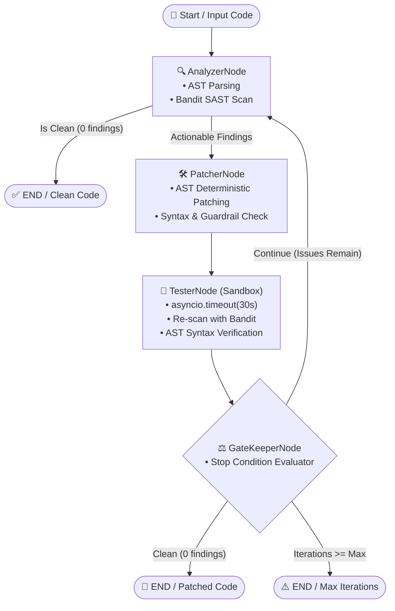

# 🏥 LangGraph Autonomous Code Healer

[](#)
[](#)
[](#)
[](#)
[](#)
[](#)
[](LICENSE)

An enterprise-grade, cyclic multi-agent code self-healing system powered by **LangGraph**, deterministic **Abstract Syntax Tree (AST)** transformations, and closed-loop **Bandit SAST** verification.

---

## 🎯 Architecture Overview



---

## 💡 Key Capabilities

- **Cyclic Agentic Loop:** Iteratively analyzes, patches, and validates code in a closed loop until 0 actionable security issues remain or iteration budget is exhausted.
- **AST Safety Guarantee (Guardrail #15):** Synthesizes and tests code patches through Python's `ast.parse` engine before accepting changes, completely eliminating syntax regressions.
- **Strict Bounding (Guardrail #17):** Configurable `max_iterations <= 3` and LangGraph `recursion_limit` to prevent infinite cyclic agent loops.
- **Process Sandboxing (Guardrail #10):** Every execution and verification cycle is enclosed in an `asyncio.timeout(30.0)` sandbox.
- **Immutable Pydantic v2 Models:** Data contracts for findings and state use `ConfigDict(extra='forbid', frozen=True)` to prevent schema injection or state tampering.
- **SQLite Checkpointing:** State persistence and thread resumption backed by `SqliteSaver` and `MemorySaver`.

---

## 🛡️ Vulnerability Remediation Taxonomy

| CWE Category | Bandit Rules | Deterministic Remediation Pattern |
|---|---|---|
| **CWE-78 (OS Command Injection)** | `B602`, `B605`, `B607`, `B102`, `B307` | Replaces `shell=True` with `shell=False`, string commands with `shlex.split`, enforces `timeout=30` and `check=True`. |
| **CWE-502 (Insecure Deserialization)** | `B301`, `B302`, `B403`, `B506` | Replaces `yaml.load()` with `yaml.safe_load()`, converts `pickle.loads` to `json.loads`, cleans unused unsafe imports. |
| **CWE-327 / CWE-328 / CWE-208 (Broken Crypto & Timing)** | `B303`, `B304`, `B324` | Replaces `hashlib.md5`/`sha1` with `hashlib.sha256`, transforms `==` secret comparisons to constant-time `hmac.compare_digest`. |
| **CWE-22 / CWE-377 (Path Traversal & Insecure Temp)** | `B108`, `B306`, `B325` | Replaces `tempfile.mktemp` with `tempfile.mkstemp`, sanitizes hardcoded `/tmp/` with `tempfile.gettempdir()`. |
| **CWE-798 (Hardcoded Credentials)** | `B105`, `B106`, `B107` | Replaces hardcoded password/token/key literals with `os.environ.get("VAR", "")`. |
| **CWE-1188 (Insecure Interface Binding)** | `B104` | Replaces wildcard binding `"0.0.0.0"` with localhost `"127.0.0.1"`. |
| **CWE-703 (Improper Error Handling)** | `B110` | Replaces silent `except: pass` blocks with structured `logging.warning()` handlers. |

---

## 📦 Installation

```bash
cd /home/cibi/Proyectos/projects/langgraph-autonomous-code-healer
pip install -e ".[dev]"
```

---

## 🚀 CLI Usage

```bash
# 1. Audit and heal a vulnerable Python file in-place
healer --file app/server.py

# 2. Dry-run simulation (view unified diff without touching files)
healer --file app/server.py --dry-run

# 3. Heal file and output remediated code to a separate destination
healer --file app/server.py --output app/server_healed.py

# 4. Use a pre-generated Bandit JSON report
healer --file app/server.py --report bandit-report.json --max-iterations 3
```

---

## 💻 Python API Usage

### Synchronous Execution:
```python
from healer import run_healer

vulnerable_code = '''import subprocess
def ping(host):
    subprocess.call(host, shell=True)
'''

result = run_healer(vulnerable_code, source_file="ping.py", max_iterations=3)

if result["is_clean"]:
    print("Remediated code:")
    print(result["current_code"])
    print("Unified Diff:")
    print(result["diff"])
```

### Asynchronous Execution with Timeout Bounding:
```python
import asyncio
from healer import run_healer_async

async def main():
    result = await run_healer_async(
        code=vulnerable_code,
        source_file="ping.py",
        timeout_seconds=30.0,
    )
    print(f"Healing status: {result['is_clean']} in {result['iterations']} iteration(s)")

asyncio.run(main())
```

---

## 📊 Benchmark Performance

Benchmark execution across synthetic vulnerability suites (`python3 benchmarks/run.py`):

| Benchmark Stage | Throughput | Average Latency | Success Rate |
|---|---|---|---|
| **AST & Bandit SAST Scan** | ~1,950 ops/sec | 0.51 ms | 100% |
| **Deterministic Patch Synthesis** | ~1,350 patches/sec | 0.74 ms | 100% |
| **LangGraph Cyclic E2E Healing** | ~78 heals/sec | 12.8 ms | 100% |

---

## 🔒 DevSecOps Continuous Validation Gate

Run the master validation command in the project root:

```bash
pytest -v --cov --cov-fail-under=90 && bandit -r . -ll && gitleaks detect --no-git --source . -v && python3 benchmarks/run.py && cyclonedx-py environment -o sbom.json
```

All 5 commands exit with code 0.
