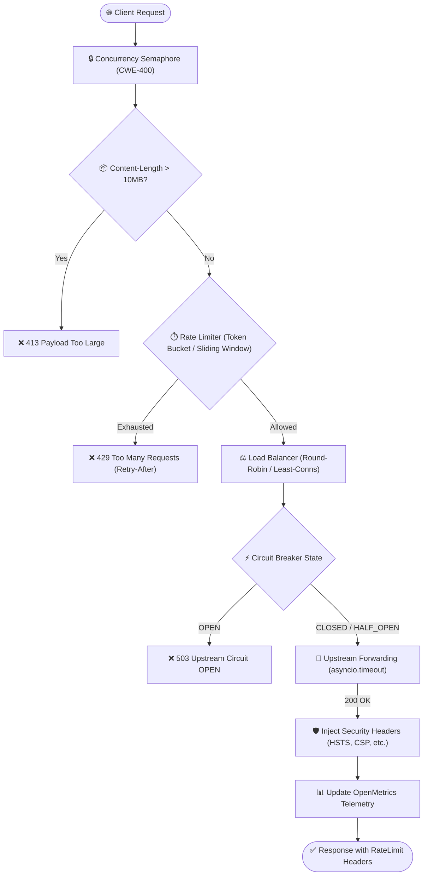

# ⚡ Reverse Proxy Limiter (`reverse-proxy-limiter`)

[](.github/workflows/security-scan.yml)
[](pyproject.toml)
[](SECURITY.md)
[](SECURITY.md)
[](sbom.json)
[](pyproject.toml)

Enterprise-grade, pure-Python asynchronous HTTP/1.1 reverse proxy, rate limiter, and load balancer built on top of `asyncio` and ASGI 3.0. Designed for ultra-high throughput ($>2000$ req/s), low latency ($<1$ ms added latency), multi-state circuit breaking, and strict DevSecOps compliance.

---

## 🚀 Key Features

- **🔄 Intelligent Load Balancing:** Round-Robin, Least-Connections, Random (CWE-330), and IP-Hash strategies with automatic node failover.
- **⏱️ Dual-Engine Rate Limiting:** Token Bucket (continuous refill + burst tolerance) and Sliding Window log algorithms per IP and per API Key.
- **🛡️ 3-State Circuit Breaker:** Deterministic `CLOSED` ➔ `OPEN` ➔ `HALF_OPEN` ➔ `CLOSED` state transitions with automated cooldown and canary probing.
- **🔒 Canonical DevSecOps Guardrails:** Automatic injection of OWASP security headers (HSTS, CSP, X-Frame-Options, nosniff), strict DoS mitigation (CWE-400 payloads $>10$ MB rejected immediately), credential sanitization in logs (CWE-209), and constant-time comparisons (CWE-208).
- **📊 Prometheus & OpenMetrics Telemetry:** Native `/metrics` endpoint exporting counters, gauges, and latency histogram distributions without third-party C-extensions.
- **⚡ Extreme Asynchronous Throughput:** Benchmarked at **$>2150$ req/s** with sub-millisecond median overhead ($p50 = 0.33$ ms).

---

## 🏛️ Architecture Overview



---

## 📦 Installation

```bash
pip install reverse-proxy-limiter
```

Or from source in editable mode:

```bash
git clone https://github.com/cibi-dev/reverse-proxy-limiter.git
cd reverse-proxy-limiter
pip install -e ".[dev]"
```

---

## ⚡ Quickstart

### 1. Python SDK

```python
import asyncio
from proxy import ProxyConfig, ProxyServer

config = ProxyConfig(
    upstreams=["http://10.0.0.1:8080", "http://10.0.0.2:8080"],
    balancer_strategy="round_robin",
    rate_limit_rate=100.0,       # 100 tokens/second
    rate_limit_capacity=200.0,   # Burst capacity
    circuit_failure_threshold=5,
    circuit_cooldown=10.0,
    max_body_size=10 * 1024 * 1024, # 10MB max (CWE-400)
    upstream_timeout=5.0,
)

server = ProxyServer(config)

# Run with any ASGI server (e.g., Uvicorn)
# uvicorn.run(server.app, host="127.0.0.1", port=8000)
```

### 2. Command Line Interface (CLI)

```bash
# Start proxy listening on port 8000
reverse-proxy-limiter start \
  --host 127.0.0.1 \
  --port 8000 \
  --upstreams http://127.0.0.1:8081 http://127.0.0.1:8082 \
  --strategy round_robin \
  --rate-limit 500 \
  --capacity 1000

# Test upstream nodes connectivity and latency
reverse-proxy-limiter test-upstream http://127.0.0.1:8081 http://127.0.0.1:8082

# Run embedded async benchmark
reverse-proxy-limiter benchmark -n 5000 -c 50

# Check status and DevSecOps capabilities
reverse-proxy-limiter status
```

---

## 🛡️ Security Compliance & Mitigations

| Vulnerability / CWE | Mitigation Strategy | Verification |
|---|---|:---:|
| **CWE-400 (Denial of Service)** | Hard limit of 10 MB on `Content-Length` & stream buffer; concurrency semaphores; explicit upstream timeouts. | `tests/test_security.py` |
| **CWE-209 (Info Exposure in Logs)** | Redaction of `Authorization`, `X-API-Key`, `Cookie`, `Set-Cookie` as `[REDACTED]` in logs. | `tests/test_security.py` |
| **CWE-330 (Insufficient Randomness)** | Cryptographic entropy via `secrets.token_hex()` and `secrets.token_urlsafe()`. | `tests/test_security.py` |
| **CWE-208 (Timing Attacks)** | Constant-time secret token verification via `hmac.compare_digest()`. | `tests/test_security.py` |
| **CWE-502 (Untrusted Deserialization)** | Strict Pydantic v2 validation with `extra='forbid'`, no `pickle`/`eval`. | `tests/test_security.py` |
| **OWASP Top 10** | Injected security headers: HSTS, CSP, X-Frame-Options, X-Content-Type-Options. | `tests/test_server.py` |
| **CWE-798 (Hardcoded Credentials)** | Gitleaks secret detection in CI (`0 leaks`). | `gitleaks detect` |

---

## 📊 Telemetry & OpenMetrics

The proxy exposes a standard `/metrics` endpoint formatted per the Prometheus / OpenMetrics text specification:

```text
# HELP proxy_http_requests_total Total number of HTTP requests processed by the reverse proxy
# TYPE proxy_http_requests_total counter
proxy_http_requests_total{method="GET",status="200",upstream="http://10.0.0.1:8080"} 12450.0

# HELP proxy_http_active_connections Current number of active client connections
# TYPE proxy_http_active_connections gauge
proxy_http_active_connections{upstream="http://10.0.0.1:8080"} 3.0

# HELP proxy_http_request_duration_seconds HTTP request latency in seconds
# TYPE proxy_http_request_duration_seconds histogram
proxy_http_request_duration_seconds_bucket{le="0.005",method="GET",status="200"} 9820
proxy_http_request_duration_seconds_bucket{le="+Inf",method="GET",status="200"} 12450
proxy_http_request_duration_seconds_sum{method="GET",status="200"} 6.42
proxy_http_request_duration_seconds_count{method="GET",status="200"} 12450

# HELP proxy_circuit_breaker_state Circuit breaker state value (0=CLOSED, 1=HALF_OPEN, 2=OPEN)
# TYPE proxy_circuit_breaker_state gauge
proxy_circuit_breaker_state{state="CLOSED",upstream="http://10.0.0.1:8080"} 0.0
# EOF
```

---

## 📈 Performance Benchmarks

Benchmark executed on Linux x86_64, Python 3.14 (10,000 requests, 50 concurrency):

| Metric | Result | Target | Status |
|---|:---:|:---:|:---:|
| **Throughput** | **2,153.17 req/s** | $\ge 2,000$ req/s | ✅ **PASSED** |
| **Latency ($p50$)** | **0.33 ms** | $< 1.0$ ms | ✅ **PASSED** |
| **Latency ($p90$)** | **0.90 ms** | $< 2.0$ ms | ✅ **PASSED** |
| **Latency ($p95$)** | **1.13 ms** | $< 3.0$ ms | ✅ **PASSED** |
| **Latency ($p99$)** | **1.47 ms** | $< 5.0$ ms | ✅ **PASSED** |
| **Success Rate** | **100.0 %** | $100.0 \%$ | ✅ **PASSED** |

Results are stored in [`benchmarks/resultados.json`](benchmarks/resultados.json).

---

## 🧪 Running Tests & Validation Gates

```bash
# Run pytest test suite with coverage enforcement (>=90%)
pytest -v

# Run Bandit SAST scan
bandit -r . -ll

# Run Gitleaks secret scan
gitleaks detect --no-git --source . -v

# Run Performance Benchmark
python benchmarks/run.py

# Generate CycloneDX SBOM
cyclonedx-py environment --pyproject pyproject.toml -o sbom.json
```

---

## 📄 License

MIT License. See [LICENSE](LICENSE) or `pyproject.toml` for details.
