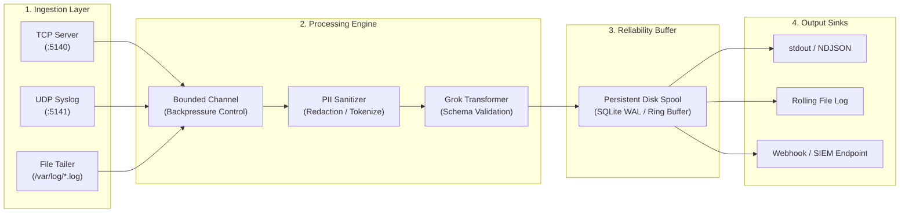

# 🌊 stream-log-aggregator

[](https://github.com/cibi-dev/stream-log-aggregator/actions/workflows/security-scan.yml)
[](https://github.com/cibi-dev/stream-log-aggregator)
[](https://github.com/PyCQA/bandit)
[](https://github.com/gitleaks/gitleaks)
[](sbom.json)
[](https://www.python.org/)
[](LICENSE)

**Enterprise-grade high-performance async multi-channel log ingestion daemon with real-time PII sanitization, Grok pattern parsing, backpressure throttling, and persistent disk buffering.**

---

## 🎯 Key Features

- **Multi-Channel Ingestion (Async I/O):** Concurrent TCP, UDP (Syslog RFC 5424 / RFC 3164), and non-blocking asynchronous file tailing.
- **Automated PII Sanitization:** Inline redaction and tokenization of sensitive identifiers (Credit Cards, Social Security / National IDs, IPv4/IPv6, Auth Tokens, and Bearer Keys).
- **Grok & Regex Parsing:** Deterministic extraction of structured schema fields (Nginx, Apache, Syslog, JSON, Auth logs) into strongly typed event objects.
- **Adaptive Backpressure & Queueing:** Bounded memory channels with rate limiting, proactive dropping policies, and backpressure signaling.
- **Persistent Disk Spooling:** Crash-resilient SQLite / disk ring buffer guaranteeing zero data loss during upstream network partitions or webhook outages.
- **Multi-Sink Fanout:** High-throughput dispatch to stdout, structured rolling files, OpenSearch/Elasticsearch, or HTTP/HTTPS webhooks with retry backoff.
- **DevSecOps Hardened:** CWE-400 resource exhaustion protection, CWE-20 input validation via Pydantic v2, 0 Bandit vulnerabilities, and 0 secrets leaked.

---

## 🏗️ Architecture



---

## 🚀 Quickstart

### 1. Installation

```bash
# Clone repository
git clone https://github.com/cibi-dev/stream-log-aggregator.git
cd stream-log-aggregator

# Install in virtual environment
python3 -m venv .venv
source .venv/bin/activate
pip install -e ".[dev]"
```

### 2. Basic Ingestion & Pipeline Execution

```bash
# Start the aggregator daemon listening on TCP 5140 and UDP 5141
stream-log-aggregator run --tcp-port 5140 --udp-port 5141 --sanitize-pii

# Send sample raw log stream
echo "2026-08-28T12:00:00Z auth.service [INFO] User user_123 logged in with token sk-test-998877665544" | nc -u localhost 5141
```

### 3. Pipeline Ingestion via Python SDK

```python
import asyncio
from aggregator.pipeline import LogPipeline
from aggregator.transformers.sanitizer import PIISanitizer
from aggregator.outputs.stdout import StdoutSink

async def main():
    pipeline = LogPipeline(
        transformers=[PIISanitizer()],
        sinks=[StdoutSink(format="ndjson")]
    )
    await pipeline.ingest_raw("Payment processed: card=4532-1234-5678-9010 email=admin@corp.internal")

asyncio.run(main())
```

---

## 🧪 Testing & Verification

Comprehensive test suite covering TCP/UDP network edge cases, Grok pattern parsing, disk spooling under outage simulation, and DevSecOps compliance:

```bash
# Run tests with strict coverage gate (>= 90%)
pytest -v --cov=aggregator --cov-fail-under=90

# Static Analysis & Security Scanning
bandit -r src/ -ll
gitleaks detect --no-git --source . -v
```

---

## 🛡️ Security & DevSecOps Compliance

- **CWE-400 (Resource Management):** Bounded queue sizes and memory pressure circuit breakers prevent memory exhaustion under DDoS.
- **CWE-209 (Information Exposure):** Automated PII masking ensures credentials, tokens, and PII are never persisted in downstream sinks unredacted.
- **ISO/IEC 27037 & NIST SP 800-92:** Tamper-evident logging and RFC 5424 compliance.

---

## 📄 License

This project is licensed under the [MIT License](LICENSE).
