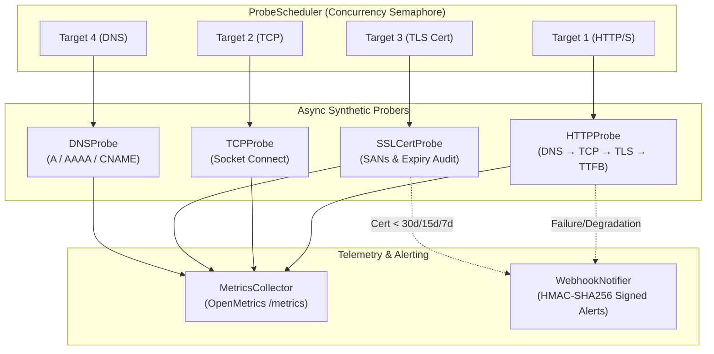

# Synthetic Blackbox Prober

[](https://github.com/cibi-dev/synthetic-blackbox-prober/actions/workflows/security-scan.yml)
[](SECURITY.md)
[](sbom.json)
[]()
[]()
[](LICENSE)

**Synthetic Blackbox Prober** es una sonda de monitoreo sintético Blackbox asíncrona de alto rendimiento y grado enterprise construida sobre Python `asyncio`. Ejecuta sondeos de disponibilidad y telemetría externa concurrente sobre **HTTP/HTTPS**, **TCP Ping**, **Handshakes TLS/SSL** e **Inspección DNS**, desglosando la latencia en microsegundos por fase (*DNS resolution, TCP connect, TLS handshake, TTFB y content transfer*) y emitiendo métricas nativas compatibles con **Prometheus / OpenMetrics**.

---

## 🎯 Capacidades Principales

- **⚡ Desglose de Latencia por Fase (Phase-Split Telemetry):**
  Aislamiento exacto de tiempos de resolución DNS (`dns_latency_ms`), establecimiento de conexión TCP (`tcp_latency_ms`), handshake TLS (`tls_latency_ms`), Time-to-First-Byte (`ttfb_ms`) y transferencia de contenido (`content_transfer_ms`).
- **🔒 Inspección de Certificados TLS & Alertas de Expiración:**
  Auditoría continua de cadenas de confianza de certificados, Subject Alternative Names (SANs) y clasificación automática de alertas en 4 escalones: `WARNING (30d)`, `CRITICAL (15d)`, `EMERGENCY (7d)` y `EXPIRED (<0d)`.
- **🌐 Sondas Sintéticas Multicapa:**
  - **HTTP/HTTPS Prober:** Verificación de códigos de estado, cabeceras, límites de descarga y métodos HTTP.
  - **TCP Port Ping:** Medición precisa del round-trip de conexión socket y detección de `ConnectionRefused`.
  - **DNS Prober:** Consulta y validación de registros `A`, `AAAA` y `CNAME` con detección de `NXDOMAIN`.
- **📊 Exportador Nativo Prometheus / OpenMetrics:**
  Servidor HTTP asíncrono integrado (`/metrics` y `/healthz`) para raspado continuo desde Prometheus, Grafana Agent o VictoriaMetrics.
- **🛡️ DevSecOps & Security Hardened:**
  Protecciones integradas contra DoS/saturación de descriptores de sockets (**CWE-400**), verificación TLS estricta por defecto (**CWE-295**), sanitización de secretos en URLs y cabeceras (**CWE-209**) y firmas HMAC en tiempo constante (**CWE-208**).

---

## 🏗️ Arquitectura Blackbox



---

## 🚀 Quickstart

### Instalación

```bash
# Modo editable con dependencias de desarrollo
pip install -e ".[dev]"
```

### 1. Uso desde la CLI

```bash
# Sondeo HTTP con desglose de latencia por fase
synthetic-blackbox-prober probe https://google.com --type http

# Salida en JSON estructurado
synthetic-blackbox-prober probe https://google.com --json

# Chequeo de expiración de certificados TLS
synthetic-blackbox-prober watch-certs google.com github.com cloudflare.com

# Ping TCP a un puerto específico
synthetic-blackbox-prober probe 1.1.1.1 --type tcp --port 53

# Consulta DNS de registro AAAA
synthetic-blackbox-prober probe google.com --type dns --record-type AAAA

# Iniciar servidor de métricas Prometheus en puerto 9115
synthetic-blackbox-prober run-server --port 9115 --targets https://google.com https://github.com
```

### 2. Uso Programático en Python

```python
import asyncio
from prober import HTTPProbe, SSLCertProbe, ProbeScheduler, ProbeTarget

async def main():
    # 1. Probar un endpoint HTTP con desglose de latencia
    http_probe = HTTPProbe()
    res = await http_probe.probe("https://httpbin.org/get")
    print(f"Total: {res.total_latency_ms}ms | DNS: {res.dns_latency_ms}ms | TCP: {res.tcp_latency_ms}ms | TTFB: {res.ttfb_ms}ms")

    # 2. Inspeccionar certificado SSL
    ssl_probe = SSLCertProbe()
    cert = await ssl_probe.probe("github.com")
    print(f"Cert Alert: {cert.alert_level} | Days Remaining: {cert.days_until_expiration} | SANs: {cert.sans[:2]}")

if __name__ == "__main__":
    asyncio.run(main())
```

---

## 📊 Métricas Prometheus Exportadas

| Métrica | Tipo | Descripción |
|---|---|---|
| `probe_success` | Gauge | `1` si el sondeo tuvo éxito, `0` en caso de fallo |
| `probe_duration_seconds{phase="dns\|tcp\|tls\|ttfb\|total"}` | Gauge | Latencia desglosada por fase en segundos |
| `probe_http_status_code` | Gauge | Código de estado HTTP retornado |
| `probe_ssl_earliest_cert_expiry` | Gauge | Timestamp UNIX de expiración del certificado |
| `probe_ssl_days_remaining` | Gauge | Días restantes antes de la expiración |
| `probe_ssl_alert_level_state{level="..."}` | Gauge | Indicador de estado de alerta (`OK`, `WARNING_30D`, `CRITICAL_15D`, `EMERGENCY_7D`, `EXPIRED`) |
| `probe_dns_lookup_time_seconds` | Gauge | Latencia de consulta DNS en segundos |
| `probe_tcp_connect_time_seconds` | Gauge | Latencia de conexión TCP en segundos |

---

## 🛡️ Seguridad y DevSecOps Compliance

Este repositorio aplica el estándar estricto de seguridad **cibi-dev**:
- **CWE-400 (Denial of Service):** Timeouts explícitos en todos los sockets y semáforo de concurrencia configurable (`ProbeScheduler`).
- **CWE-295 (Improper Certificate Validation):** Validación estricta de CAs y hostnames activa por defecto.
- **CWE-209 (Sensitive Information Leakage):** Redacción automática (`[REDACTED]`) de contraseñas de Basic Auth y parámetros de consulta como `token`, `key`, `secret`, `api_key` en URLs y logs.
- **CWE-208 (Timing Attacks):** Firmas de alertas webhooks calculadas y verificadas con `hmac.compare_digest`.
- **CWE-798 (Hardcoded Credentials):** 0 secretos detectados mediante análisis estricto con `gitleaks`.

---

## 🧪 Verificación y Gates

```bash
# 1. Ejecución de la suite completa de tests con cobertura (>=90%)
pytest -v

# 2. Análisis estático de seguridad SAST
bandit -r . -ll

# 3. Detección de secretos
gitleaks detect

# 4. Ejecución de benchmarks
python benchmarks/run.py

# 5. Generación de SBOM CycloneDX
cyclonedx-py environment --pyproject pyproject.toml -o sbom.json
```
